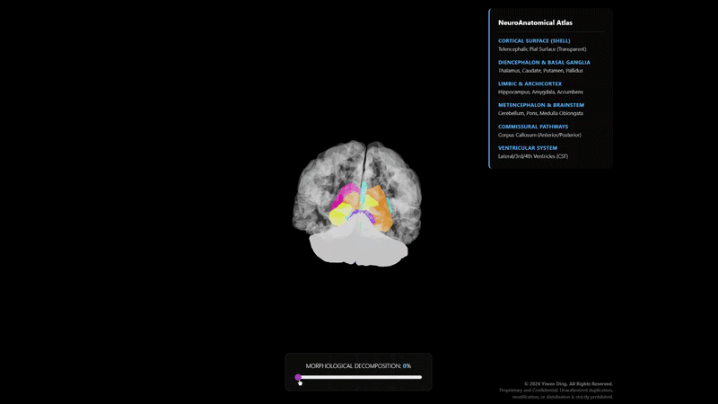

<div align="center">
  
</div>

# Ding's NeuroAtlas | Academic Visualization
###  An Interactive 3D NeuroAnatomical Digital Twin 🧠

---

## Overview

This project presents a high-fidelity, interactive 3D visualization of human neuroanatomy, reconstructed from raw MRI data. The application allows users to explore the internal structures of the brain through a **"Glass Brain" explosion interface**, facilitating both educational and research-oriented anatomical studies.

---
### Project Specifications
| Attribute | Details |
| :--- | :--- |
| **Current Version** | v1.0 |
| **Release Date** | March 14, 2026 |
| **Developer** | Yiwen Ding |
| **License** | Proprietary (Personal Use Only) |

## Interaction & Visual Demos

### Morphological Decomposition (Quick Preview)


*A 15-second loop demonstrating the radial explosion and mesh smoothing.*

---

### Functional Walkthrough (High-Res)
[Download/Watch: Web Viewer Demo](./assets/Ding’s%20NeuroAtlas_demo.mp4)

> **Key Focus**: This video demonstrates the **Raycasting interaction** and the real-time anatomical labeling system.

### Full 360° Rotational Study
[Download/Watch: Brain Rotation Demo](./assets/Brain_rotation_video.mp4)

---

## 🌐 Project Live Access

**[Launch Ding's NeuroAtlas (Web Version)](https://dingonewen.github.io/NeuroAtlas-Web/)**

> For the best experience, please use a WebGL-compatible browser (Chrome/Edge/Safari). The interface is optimized for desktop interaction.

---

## Technical Pipeline: From Voxel to Mesh

The reconstruction process involved a complex multi-stage pipeline, integrating medical imaging standards with modern 3D computer graphics.

```
MRI (DICOM)  →  NIfTI Volume  →  FreeSurfer / 3D Slicer Segmentation
     →  Python Mesh Pipeline  →  GLB Asset  →  Three.js Web Viewer
```

### 1. Data Acquisition & Pre-processing

- **Source Data:** High-resolution MRI scans in DICOM format.
- **Format Conversion:** Utilizing `ratirat` and specialized scripts to convert raw slices into NIfTI volumes for downstream processing.

### 2. Segmentation & Anatomical Modeling

- **3D Slicer:** Used for manual and semi-automated segmentation of specific regions of interest, ensuring anatomical accuracy.
- **FreeSurfer:** Employed for automated subcortical segmentation (`aseg`) and cortical surface reconstruction (`pial` surfaces). This stage involved intensive CPU-bound computation to define the precise boundaries of **31+ brain structures**.

### 3. Mesh Optimization & Refinement

**Scripts:** `Extract_brain_parts.py` · `Pial_to_obj.py` · `Pack_and_smooth.py`

| Step | Description |
|------|-------------|
| **Extraction** | `Extract_Brain_Parts.py` — Reads `aseg.mgz`, creates binary masks per anatomical label, runs Marching Cubes, and applies the affine RAS transform to export each structure as an individual `.obj` file. |
| **Cortex Conversion** | `Pial_to_obj.py` — Reads FreeSurfer `.pial.T1` surfaces for both hemispheres and exports them as `.obj` meshes using `nibabel` + `trimesh`. |
| **Smoothing & Packing** | `Pack_and_smooth.py` — Applies **Laplacian smoothing** (15 iterations) to eliminate the voxel staircase effect, assigns unique colors per structure, and packs everything into a single `.glb` container for efficient web delivery. |

**Python dependencies:** `nibabel`, `numpy`, `scikit-image`, `trimesh`

### 4. Web Implementation (Three.js)

**File:** `index.html`

- **Raycasting Interaction:** A high-precision `Raycaster` enables real-time hover detection and anatomical labeling.
- **Glass Brain Shader:** Selective transparency logic (`opacity = 0.15`, `depthWrite = false`) maintains a "glass shell" effect for the cortex while keeping internal nuclei fully opaque.
- **Morphological Decomposition:** A dynamic explosion algorithm deconstructs the brain along normalized radial vectors, driven by a UI slider.

---

## Features

- **Interactive Atlas** — Hover over any structure (e.g., Hippocampus, Amygdala) to view its anatomical name.
- **Exploded View** — Decompose the brain to reveal deep-seated structures such as the Diencephalon and Ventricular system.
- **Anatomical Legend** — Categorized legend for learning functional brain groups:
  - Cortical Surface (Telencephalic Pial Surface)
  - Diencephalon & Basal Ganglia
  - Limbic System & Archicortex
  - Metencephalon & Brainstem
  - Commissural Pathways (Corpus Callosum)
  - Ventricular System (CSF)
- **Orbit Controls** — Rotate, pan, and zoom freely in 3D.

---

## Usage Notice

This project is intended for **educational and research purposes only**.

- **Non-Commercial Use:** This application and its associated data may not be used for any commercial profit.
- **Data Privacy:** The 3D model is derived from proprietary anatomical data.

---

## License & Copyright

Copyright © 2026 **Yiwen Ding**. All Rights Reserved.

- **Proprietary Data:** The 3D geometry and specific anatomical reconstructions are the intellectual property of Yiwen Ding.
- **Strict Restrictions:**
  - No part of this repository (including the GLB model and interaction logic) may be redistributed, re-hosted, or modified without explicit written permission.
  - Unauthorized duplication, scraping, or use of the 3D meshes for external projects is strictly prohibited.
  - Any academic use must provide full attribution to the author.
